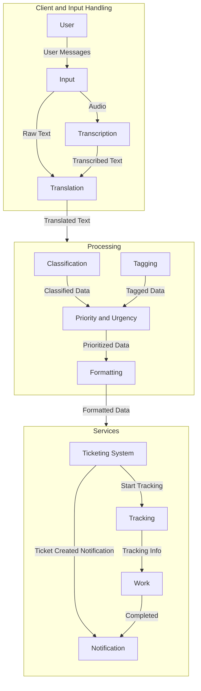

# SpeakUp (WIP)
###### A Modular, Multilingual AI-Based Application for Streamlined Issue Management and Authority Communication

## Overview

SpeakUp is an AI project aimed at helping citizens to report issues in their locality to the concerned authorities. The project is designed to be a platform where users can report issues like potholes, broken streetlights, etc. The platform will then automatically forward the issue to the concerned authorities. The platform will also provide a way for the authorities to track the status of the issues and update the users.

## Goals

The main goal of the project is to provide a platform for citizens to report issues in their locality. The platform should be easy to use and should allow users to report issues quickly and easily. The platform should also provide a way for the authorities to track the status of the issues and update the users.

## System Design

The system is designed to be highly modular, scalable, and extensible. The components of the system are designed to work together seamlessly to provide a smooth user experience. Any module can be replaced with a different implementation without affecting the rest of the system.

The system will consist of several components:

1. **AI Chatbot**: The chatbot will be the main interface for users to report issues. The chatbot will use natural language processing to understand the user's message and forward it to the concerned authorities.

2. **Translation Service**: The translation service will be used to translate the user's message into english. This will help in cases where the user's message is in a different language.

3. **Transcription Service**: The transcription service will be used to convert the user's voice message into text. This will help in cases where the user is unable to type the message.

4. **Classification Service**: The classification service will be used to classify the user's message into different categories based on the issue reported and the government department responsible for it.

5. **Tagging Service**: The tagging service will be used to tag the user's message with relevant tags. This will help in tracking the issues.

6. **Priority and Urgency Service**: The priority and urgency service will be used to assign priority and urgency to the issues reported by the users.

7. **Notification Service**: The notification service will be used to notify the authorities about the new issue reported by the user.

8. **Tracking Service**: The tracking service will be used to track the status of the issues reported by the users and update the users.

9. **Formatting Service**: The formatting service will be used to format the user's message into a custom format that can be easily read by the authorities.

## Implementation

### High-Level Architecture

